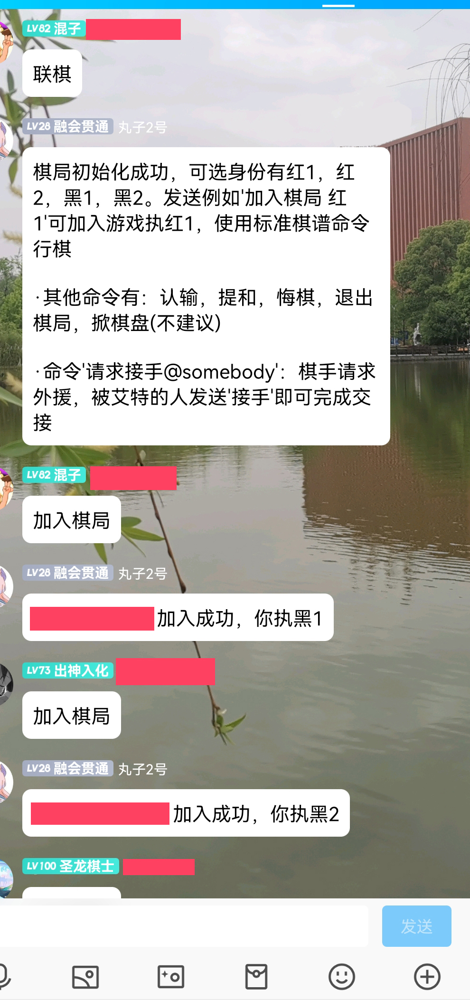

# ChineseChess
这是一个用java写的中国象棋模块

- [效果展示](#效果展示)
- [功能介绍](#功能介绍)
- [如何使用](#如何使用)
- [克隆](#克隆)
- [License](#license)


## 效果展示
### 红黑方视角
1.黑方"士6进5"行棋完毕，出现黑方走子提示。当前该红方行棋，所以棋盘是红方视角。


2.红方"炮8进7"行棋完毕，出现红方走子提示。当前该黑方行棋，所以棋盘是黑方视角。


### 棋盘和棋子风格
3.支持棋盘风格，棋子风格的切换（需要对应素材）。目前上传了几款棋盘风格，可以在imgae/map/文件夹下查看

3.1 花时舞者-神里凌华


3.2 清凉夏日-猫羽雫


**注：双方的棋盘和棋盘风格是独立的，棋子和棋盘也可以任意搭配**

**别急，看看下面再走啊**


## 功能介绍
目前完成了基本的中国象棋功能，需通过标准命令（棋谱命令）行棋
### 双人棋和四人棋（联棋），多人棋



### 盲棋
开启盲棋功能则不发送图片，改为发送文字提示，盲棋功能可随时关闭


### 其他功能：悔棋，认输，换人，掀棋盘等
注：考虑到难度与性能问题，暂时没有绝杀判断，需要吃掉对方的将帅或者认输才能判定输赢

**---------对于非开发者-------------**
此功能的插件已经做好，请到release下载，仅适配[Mirai机器人](https://mirai.mamoe.net/)框架

**---------非开发人员止步-------------**

**---------开发人员看下面-------------**

这是一个与框架无关的纯象棋功能模块，若你需要对命令进行自定义，请参考下面(如何使用)

# 如何使用

本包提供了各种对棋局进行操作的接口，但是没有让命令与接口关联，需要开发者自定义命令，并调用对应接口即可
作者也会在一段时间后写一个大众一点的命令适配器。

## 1.Enum.java
定义了一些棋盘类型，棋子类型，红黑方，棋盘状态的枚举

## 2.ChessExcept.java
定义了一些行棋过程中常见的异常：比如命令不正确，移动不正确等

## 3.ChessControl类
该类定义了**对棋局进行操作的接口**，开发者需要为每一个棋局创建一个ChessControl对象

### 3.1 棋局状态
参见**Enum.java**文件中的**State**枚举，棋局有3种状态

**State.init**: 刚创建好ChessControl对象或者棋局结束后会处于这个状态，需要手动跳转到pre状态

**State.pre**: 棋局等待棋手加入中，棋手加入满则进入began状态

**State.began**: 棋局正在对弈，对弈结束则进入init状态
### 3.2 重要方法
**ChessControl.start()**: 开始棋局，将棋子重置在初始位置，进入began状态，同时开始接受行棋命令。

**ChessControl.over()**: 结束棋局，同时统计用时等参数

**ChessControl.move(String cmd)**: 输入的是棋谱命令，对棋子进行移动操作，会弹出棋类异常，进行捕获可以查看异常信息：

```
ChessControl control = new ChessControl("test");
control.start();
String cmd = "炮二平五";
try
{
    control.move(cmd);
}
catch(ChessExcept e)
{
    System.out.println(e);
}
```

**ChessControl.retract()**: 悔棋

**ChessControl.changeMapStyle(Team team, MapStyle style)**: 更换棋盘风格，输入参数含义：哪一方更换什么风格

算了，干饭了，先这样
